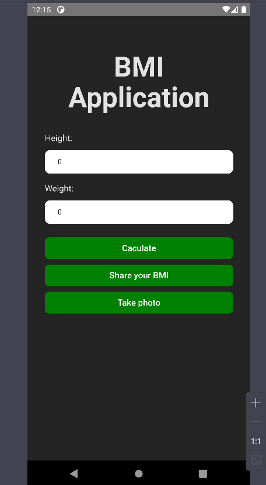
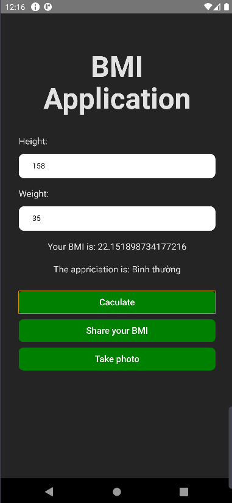
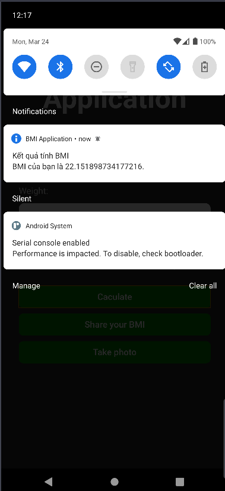
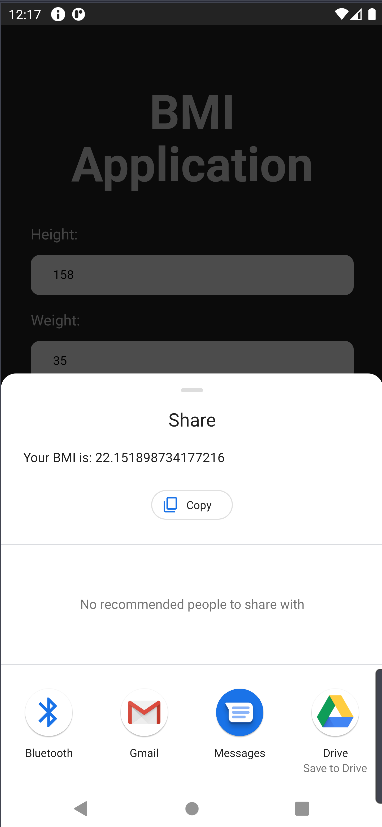
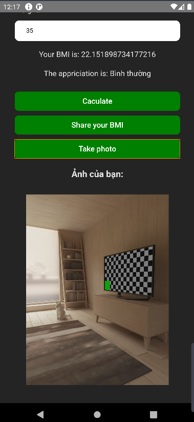

# Capacitor built by React

## Clone code

```bash
  git clone https://github.com/datmaiz/multiple-platform-middterm
```

## Install packages

Open project in VS code and open terminal, excute command:

```bash
  npm install
```

## Build to android app

```bash
  npm run build
  npx cap sync
```

## Open in android

```bash
  npx cap open android
```

This command will open Android Simulator in Android Studio. Please wait a minute. When it have done, run app in Android Studio and use

## Some images about app






